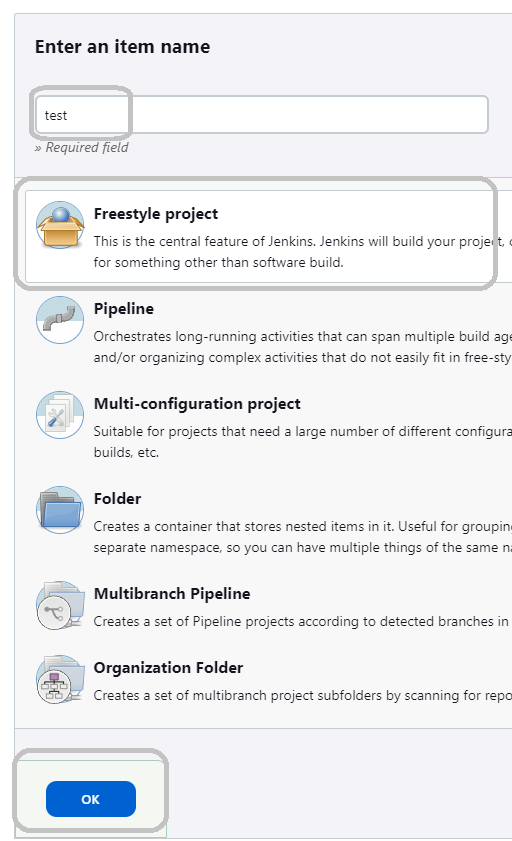
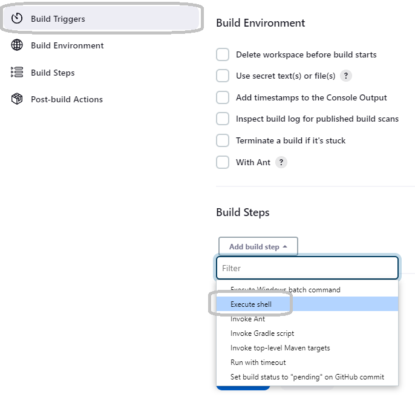
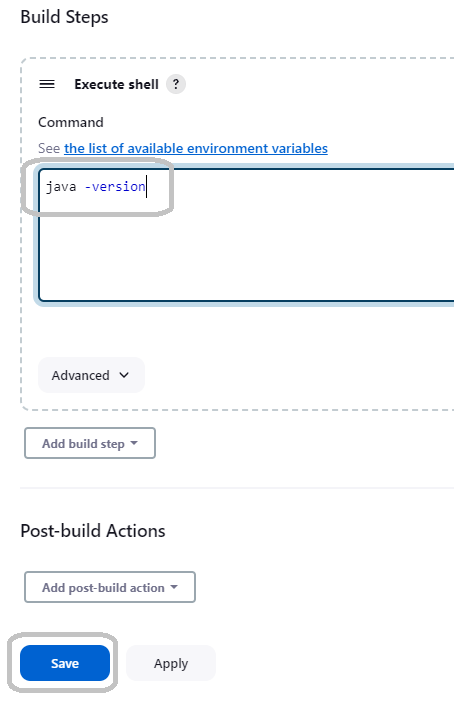

### Freestyle project

#### Step 1

Select in "New Item" 

#### Step 2

Put a name, select "Freestyle project" and click "Ok"

#### Step 3

Go to "Build steps", select "Execute shell" and configure command `java -version`

