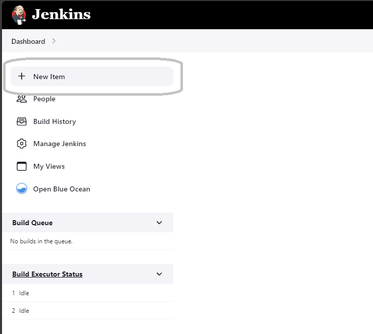
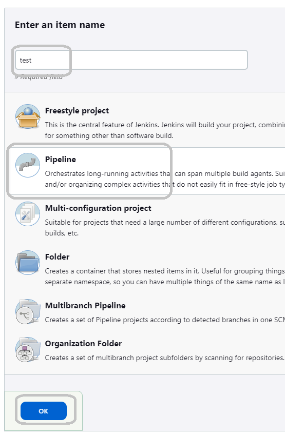
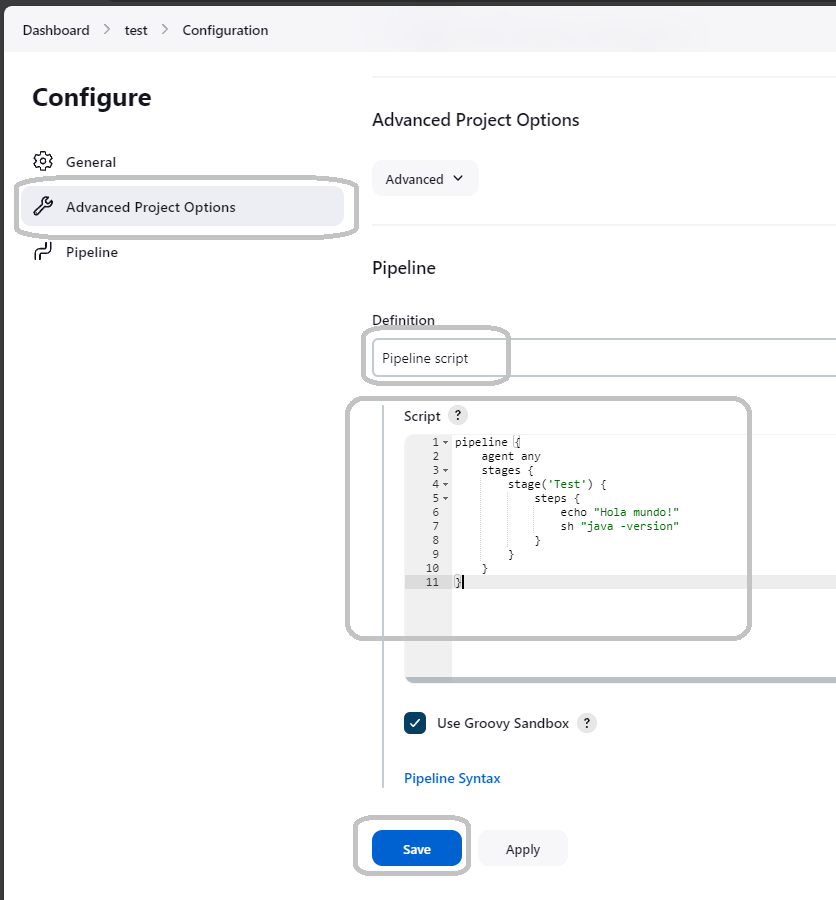

#### Step 1

Select in "New Item" 



#### Step 2

Put a name, select "Pipeline" and click "Ok"



#### Step 3

Go to "Advanced Project Options", select "Pipeline script", and configure script like above



```
pipeline {
    agent any
    stages {
        stage('Test') {
            steps {
                echo "Hola mundo!"
                sh "java -version"
            }
        }
    }
}
```
