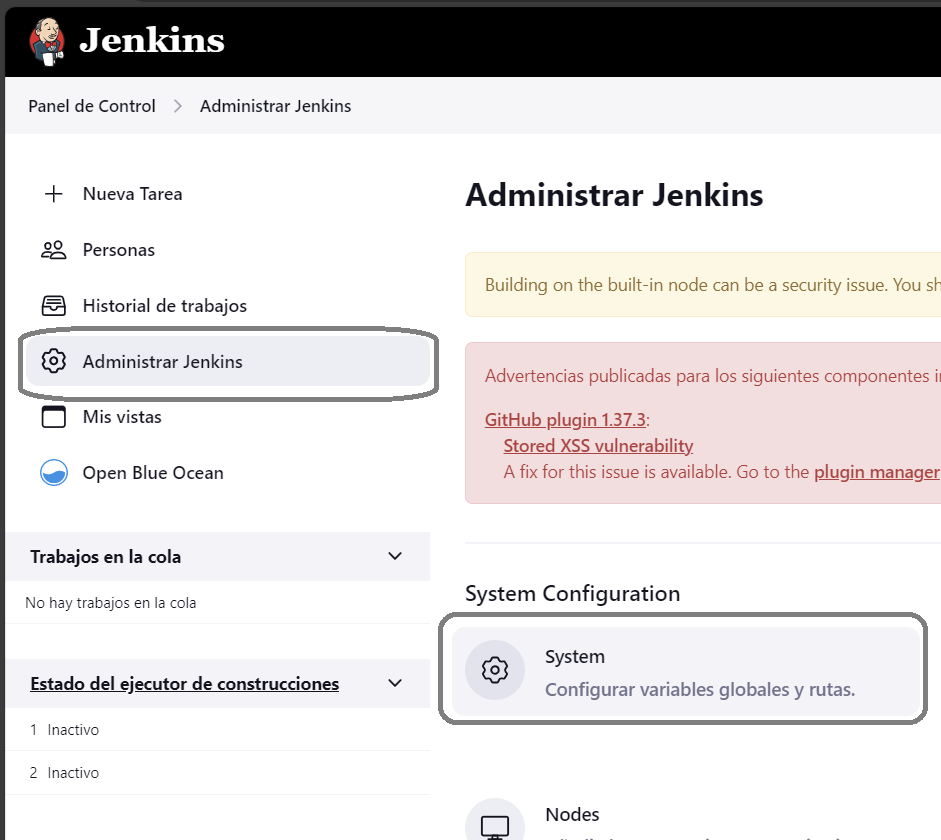

#### Step 1

Select in "Manage Jenkins" and "System"



#### Step 2

Search "Global Pipeline Libraries", put name "`shared-library`" and set Default version like "`main`"


#### Step 3

In "Source Code Managment" set "GitHub", paste in "Repository HTTPS URL" "`https://github.com/xlmriosx/jenkins-library.git`" and save


#### Step 4

##### Option 1
Create a "Pipeline" and use:

```
@Library ('shared-library')_

pipeline {
    agent any
    stages{
        stage('Build'){
            steps{
                script{
                    build()
                }
            }
        }
    }
}
```

##### Option 2

Create a "Multibranch" and use previous repository (`https://github.com/xlmriosx/jenkins.git`)

Configurate "Script Path" like `shared-library/Jenkinsfile`
